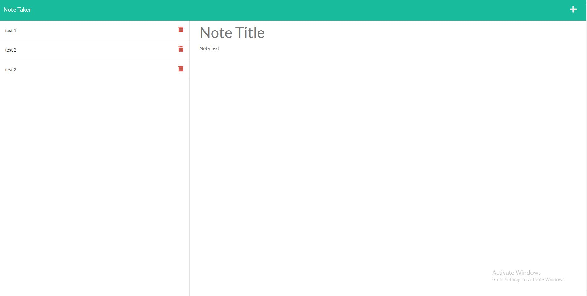

# Note Taker

# Built with
* bootstrap
* fontawesome
* uniqID
# Getting Started

To run this will require a few npm packages, namely uniqid and express. To host your own, you can deploy through heroku

# Usage

Usage of the app is fairly intuitive. The plus button will allow you to start a new note. After entering the title and text, hit the save icon and the note will be saved to your list. Existing notes can be viewed by clicking the title in the left hand column. If you would like to delete a note, click the trash can icon and the note will be removed.

# Backend Build Process

The backend of the app was built through an express.js server. The buttons on the app are handled into API calls to the express server and update or get info from the server's json file. 

# Deployed App
https://afternoon-cove-78860.herokuapp.com/